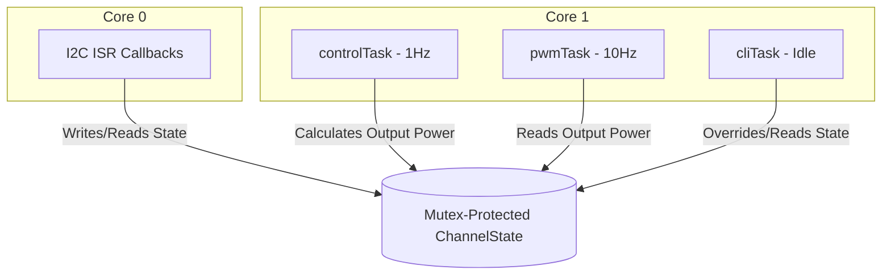

# Design Specification: Thermal MCU Controller (ESP32)

## 1. System Overview
The Thermal MCU is an I2C slave controller built on the Arduino Nano ESP32 (ESP32-S3). It manages 8 distinct MOSFET channels (digital pins D2–D9) to regulate temperatures via heater or cooler configurations. The MCU runs a multi-threaded FreeRTOS firmware to isolate high-speed communications, control loop calculations, and software-based PWM generation.

---

## 2. Hardware Allocation

The 8 MOSFET channels are mapped to the physical digital pins as follows:

| Channel ID | Channel Name | Arduino Pin |
|---|---|---|
| **Ch 0** | `sdcrd` | `D2` |
| **Ch 1** | `P_ch` | `D3` |
| **Ch 2** | `outl` | `D4` |
| **Ch 3** | `INlt 1` | `D5` |
| **Ch 4** | `INLT2` | `D6` |
| **Ch 5** | `PLT1` | `D7` |
| **Ch 6** | `PLT2` | `D8` |
| **Ch 7** | `BCKUP` | `D9` |

*Note: Pins are configured as `OUTPUT` and initialized to `LOW` on boot.*

---

## 3. Thread Architecture (FreeRTOS)

To ensure concurrency safety and deterministic control, the software is divided into four main tasks:



1. **`i2cTask` (Core 0, High Priority / ISR Context)**:
   - Responds to Master Write (`onReceive`) and Read (`onRequest`) events.
   - Validates CRC-8.
   - Safely updates channel state or prepares the response packet.
2. **`controlTask` (Core 1, Medium Priority, 1 Hz)**:
   - Calculates the control loop outputs (PID, Hysteresis, or Manual duty cycle).
   - Monitors safety guardrails (runaway checks, timeout checks, sensor health).
3. **`pwmTask` (Core 1, Low-Medium Priority, 10 Hz / 100 ms)**:
   - Drives software PWM on pins D2-D9 based on the current calculated output power.
4. **`cliTask` (Core 1, Low Priority, Event-driven)**:
   - Processes diagnostic commands from USB Serial.

---

## 4. Shared State & Mutex Strategy

To prevent race conditions (such as torn 16-bit temperature reads/writes) during asynchronous I2C updates, each of the 8 channels has an independent Mutex. 

### Data Structures

```cpp
enum ControlMode {
    MODE_HYSTERESIS = 0,
    MODE_PID = 1,
    MODE_MANUAL = 2
};

struct ChannelConfig {
    bool isCooler;          // true = Cooler (reverse acting), false = Heater (direct acting)
    uint32_t pwmPeriodMs;   // Software PWM period (10,000 to 60,000 ms)
    float kp, ki, kd;       // PID tuning parameters
    int16_t hystDelta;      // Hysteresis window delta (scaled by 100, e.g. 50 = 0.50 C)
    uint32_t commTimeoutMs; // Maximum time allowed between Master writes (default 30,000 ms)
};

struct ChannelState {
    ControlMode mode;
    uint8_t manualPower;      // Manually set power percentage (0-100)
    int16_t currentTemp;      // Current temperature (scaled by 100)
    int16_t targetTemp;       // Target setpoint temperature (scaled by 100)
    uint8_t outputPower;      // Calculated power (0-100%)
    
    uint8_t statusByte;       // Safety warning and error flags
    
    uint32_t lastWriteTimeMs;     // Millis of last valid I2C Write command
    uint32_t maxPowerStartTimeMs; // Millis when high-power threshold was breached
    int16_t tempAtMaxPowerStart;  // Temperature when high-power threshold was breached
    
    float integralError;      // PID accumulator
    int16_t previousTemp;     // For Derivative-on-Measurement
};
```

---

## 5. I2C Communications Protocol

The Nano operates as an I2C slave. All transactions from the Master are **Write-then-Read** sequences: a write of 8 bytes is followed immediately by a read of 8 bytes.

### A. Master Write Packet (8 Bytes)
Sent to update a channel's settings:

| Byte | Field | Data Type | Description |
|---|---|---|---|
| **0** | Command / Register | `uint8_t` | `0x01` = Update/Request Channel State |
| **1** | Channel ID | `uint8_t` | `0x00` to `0x07` |
| **2** | Mode / Power | `uint8_t` | `0` = Hysteresis, `1` = PID, `155` to `255` = Manual Mode (`0%` to `100%`) |
| **3** | Current Temp MSB | `int8_t` | High byte of 16-bit signed integer |
| **4** | Current Temp LSB | `uint8_t` | Low byte of 16-bit signed integer |
| **5** | Target Temp MSB | `int8_t` | High byte of 16-bit signed integer |
| **6** | Target Temp LSB | `uint8_t` | Low byte of 16-bit signed integer |
| **7** | Checksum | `uint8_t` | CRC-8 of Bytes 0 through 6 |

*Note: In Manual Mode, `manualPower = Mode - 155`.*

### B. Master Read Packet (8 Bytes)
Returned by the Nano containing current channel status:

| Byte | Field | Data Type | Description |
|---|---|---|---|
| **0** | Channel ID | `uint8_t` | `0x00` to `0x07` |
| **1** | Active Mode | `uint8_t` | `0` = Hysteresis, `1` = PID, `2` = Manual |
| **2** | Output Power | `uint8_t` | `0` to `100` (%) |
| **3** | Target Temp MSB | `int8_t` | High byte of 16-bit signed target setpoint |
| **4** | Target Temp LSB | `uint8_t` | Low byte of 16-bit signed target setpoint |
| **5** | Status Byte | `uint8_t` | Bit flags for warning/error status |
| **6** | Padding | `uint8_t` | Reserved for future use (default `0x00`) |
| **7** | Checksum | `uint8_t` | CRC-8 of Bytes 0 through 6 |

### C. The "Bad CRC" Transaction Guard
To prevent acting on or returning corrupted data when I2C transfers suffer electrical noise:
1. If the calculated CRC-8 in `onReceive` does **not** match Byte 7:
   - The payload is immediately discarded.
   - The global pointer `lastAddressedChannel` is set to `0xFF`.
2. When the Master immediately calls `onRequest` to read the status:
   - The Nano detects `lastAddressedChannel == 0xFF`.
   - It returns a dedicated **CRC Error Packet**:
     - `Byte 0 = 0xFF` (Invalid Channel ID)
     - `Byte 1 = 0xFF` (Invalid Mode)
     - `Byte 2-4 = 0`
     - `Byte 5 = 0x08` (`FLAG_CRC_ERROR` active)
     - `Byte 6 = 0`
     - `Byte 7 = CRC-8 Checksum`
   - The Master detects the `0xFF` Channel ID and the `FLAG_CRC_ERROR` bit, then initiates a retransmission of the Write command.

### D. CRC-8 Calculation Algorithm
Uses the SMBus polynomial $x^8 + x^2 + x + 1$ (`0x07`), initialized to `0x00`.
```cpp
uint8_t calculateCRC8(const uint8_t *data, size_t length) {
    uint8_t crc = 0x00;
    for (size_t i = 0; i < length; i++) {
        crc ^= data[i];
        for (uint8_t j = 0; j < 8; j++) {
            if (crc & 0x80) {
                crc = (crc << 1) ^ 0x07;
            } else {
                crc <<= 1;
            }
        }
    }
    return crc;
}
```

---

## 6. Control Loop Algorithms

### Hysteresis Mode
Calculates binary output power ($0\%$ or $100\%$) with a deadband window (`hystDelta` scaled by 100, e.g. 50 for $0.50^\circ\text{C}$).
- **Heater Configuration**:
  - Turn ON ($100\%$): if $\text{currentTemp} < \text{targetTemp} - \text{hystDelta}$
  - Turn OFF ($0\%$): if $\text{currentTemp} > \text{targetTemp} + \text{hystDelta}$
- **Cooler Configuration**:
  - Turn ON ($100\%$): if $\text{currentTemp} > \text{targetTemp} + \text{hystDelta}$
  - Turn OFF ($0\%$): if $\text{currentTemp} < \text{targetTemp} - \text{hystDelta}$

### PID Mode
Calculates proportional, integral, and derivative outputs. Runs at 1 Hz ($\Delta t = 1.0\text{ s}$).
- **Error calculation**:
  - Heater: $\text{error} = \frac{\text{targetTemp} - \text{currentTemp}}{100.0}$
  - Cooler: $\text{error} = \frac{\text{currentTemp} - \text{targetTemp}}{100.0}$
- **Derivative on Measurement**:
  To prevent "derivative kick" spikes during setpoint changes:
  - Heater: $D = -K_d \times \frac{\text{currentTemp} - \text{previousTemp}}{100.0}$
  - Cooler: $D = K_d \times \frac{\text{currentTemp} - \text{previousTemp}}{100.0}$
- **PID Math & Windup Guard**:
  - $P = K_p \times \text{error}$
  - $I_{\text{candidate}} = \text{integralError} + (K_i \times \text{error})$
  - $\text{output} = P + I_{\text{candidate}} + D$
  - Clamping & Anti-Windup:
    - If $\text{output} \ge 100.0 \rightarrow \text{output} = 100.0$, do not update integral error (if error is same sign).
    - If $\text{output} \le 0.0 \rightarrow \text{output} = 0.0$, do not update integral error (if error is same sign).
    - Otherwise, $\text{integralError} = I_{\text{candidate}}$.

---

## 7. Software PWM Pin Driver

The `pwmTask` updates digital output states at $10\text{ Hz}$ ($100\text{ ms}$ intervals).

1. Tracks cycle time: `cycleElapsed = millis() - channelCycleStart[ch]`.
2. Restarts cycle: If `cycleElapsed >= config.pwmPeriodMs`, set `channelCycleStart[ch] = millis()` and `cycleElapsed = 0`.
3. Determines state:
   - `onDurationMs = (config.pwmPeriodMs * state.outputPower) / 100`
   - If `cycleElapsed < onDurationMs` $\rightarrow$ set pin HIGH.
   - Else $\rightarrow$ set pin LOW.

---

## 8. Safety Protections & Status Byte

The `statusByte` is sent to the Master in the Read packet:

| Bit | Flag Name | Mask | Description |
|---|---|---|---|
| **0** | `FLAG_COMM_TIMEOUT` | `0x01` | Active if no valid Master writes occurred in last 30 seconds. |
| **1** | `FLAG_THERMAL_RUNAWAY` | `0x02` | Active if power stays high but temperature doesn't respond. |
| **2** | `FLAG_SENSOR_ERROR` | `0x04` | Active if input temperature is out of bounds or represents a sensor fault. |
| **3** | `FLAG_CRC_ERROR` | `0x08` | Active only in CRC error status packet (Channel ID `0xFF`). |

### Safety Logic Implementations

#### A. Communication Timeout Watchdog
If `millis() - state.lastWriteTimeMs > config.commTimeoutMs`:
- Set `state.statusByte |= FLAG_COMM_TIMEOUT`.
- **Force safety state**: If `state.mode != MODE_MANUAL`, set `state.outputPower = 0` (override controls to turn the MOSFET off). If `state.mode == MODE_MANUAL`, we keep warning flags active but bypass the shutdown, continuing to output the requested `manualPower`.
- Clearing: Any valid subsequent Master write resets the timer and clears this flag.

#### B. Thermal Runaway Protection (High-Power Guard)
Uses a threshold range to avoid noise loop-holes:
- **Trigger Condition**: If `outputPower >= 95`:
  - If `maxPowerStartTimeMs == 0`, start the timer: `maxPowerStartTimeMs = millis()`, `tempAtMaxPowerStart = currentTemp`.
  - Else, check elapsed time: If `millis() - maxPowerStartTimeMs > 60000`:
    - Calculate `tempDelta = currentTemp - tempAtMaxPowerStart`.
    - Heater: If `tempDelta < 50` (less than $0.50^\circ\text{C}$ rise), set `FLAG_THERMAL_RUNAWAY`.
    - Cooler: If `tempDelta > -50` (less than $0.50^\circ\text{C}$ drop), set `FLAG_THERMAL_RUNAWAY`.
- **Hysteresis Reset Condition**: Else if `outputPower < 50`:
  - Reset `maxPowerStartTimeMs = 0`.
  - Clear `FLAG_THERMAL_RUNAWAY` status bit.

#### C. Sensor Failure Protection
If `currentTemp == -9999` (or out of safety boundaries like $<-50^\circ\text{C}$ or $>250^\circ\text{C}$):
- Set `state.statusByte |= FLAG_SENSOR_ERROR`.
- **Force safety state**: If `state.mode != MODE_MANUAL`, set `state.outputPower = 0`. If `state.mode == MODE_MANUAL`, the shutdown is bypassed, allowing manual control overriding during sensor diagnostic tests.

---

## 9. Non-Volatile Storage (NVS) & Serial CLI

### NVS Storage
Default parameters are loaded from NVS under the namespace `"thermal"` on startup. The `save` CLI command flushes runtime updates to flash.

### Serial CLI Command List
- `status`: Displays channel configurations, states, active outputs, and safety status.
- `monitor`: Periodically reprints the status table every 500 ms (exits when any key is pressed).
- `set <ch> <m/b/p> [val]`: Temporarily overrides channel mode and target parameter.
- `tune <ch> <kp> <ki> <kd>`: Changes PID constants.
- `config <ch> <h/c> <period>`: Sets heating/cooling type and PWM period.
- `save`: Saves configurations to NVS.
- `load`: Reloads configurations from NVS.
- `help`: Prints command syntax.
